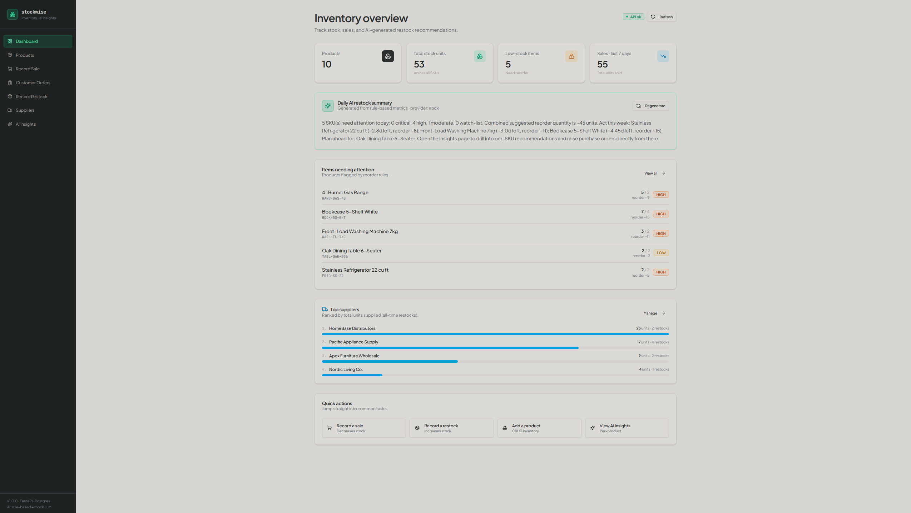
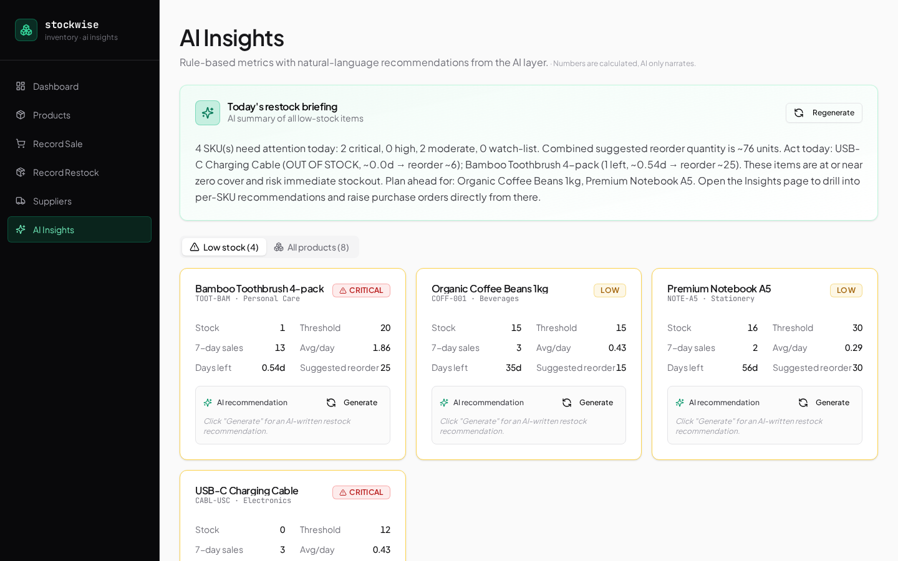
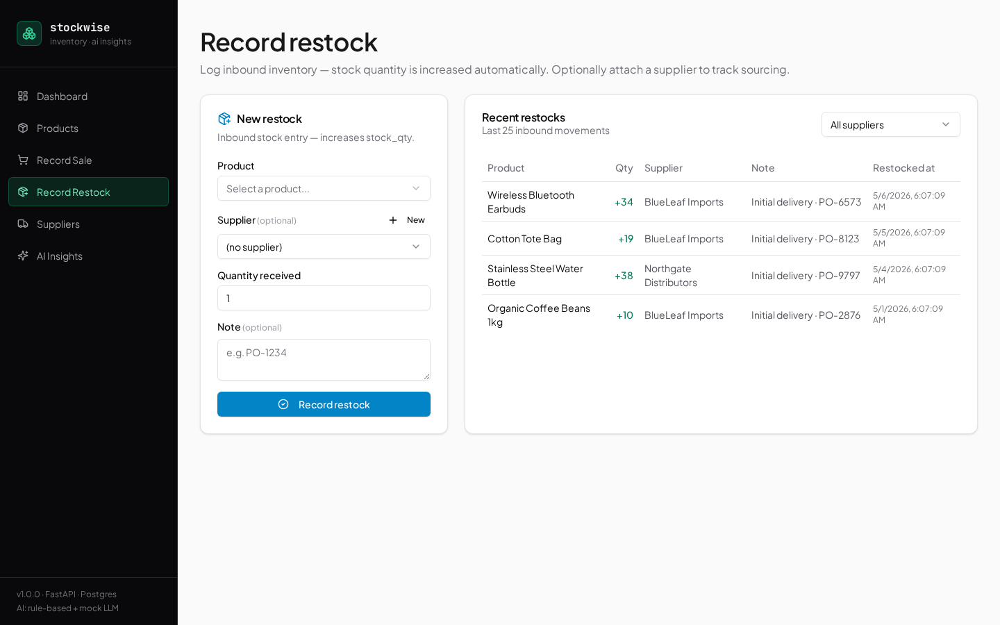

# Stockwise — Inventory Management & CRM Sales Pipeline

Stockwise is a web app for small businesses that covers both sides of the sales cycle: inventory operations and customer pipeline tracking. On the inventory side it tracks products, sales, restocks, and suppliers, and flags items that need reordering using rule-based metrics and plain-language AI restock notes. On the CRM side it tracks customer inquiries, lead opportunities, and follow-up tasks through a configurable pipeline before any inventory movement happens.



## What problem it solves

Small shops and side-business operators often manage inventory through spreadsheets, memory, or scattered notes. Stockwise gives that workflow a more structured path:

**Inventory operations:**

- sales are recorded as outbound stock movements,
- restocks are recorded as inbound stock movements,
- suppliers can be linked to restock history,
- low-stock items are flagged using explainable rules, and
- restock recommendations are written in plain language so the numbers are easier to act on.

**Customer pipeline:**

- customer inquiries are captured before they affect inventory,
- each inquiry moves through a sales pipeline (New → Contacted → Qualified → Proposal → Won / Lost),
- a product-based quote form calculates estimated deal value from unit price, quantity, discount, and delivery fee,
- follow-up tasks keep the pipeline moving without a separate task tool, and
- pipeline KPI cards show open value, won/lost totals, and upcoming follow-ups at a glance.

The goal is not to replace a full ERP system. It is a practical operations dashboard for a small operator who wants to understand what is in stock, what is running low, and what deals are in progress.

## Core features

### Inventory operations

- **Products** — create, view, update, and delete products with name, SKU, category, stock quantity, reorder threshold, and unit price.
- **Sales tracking** — recording a sale automatically decreases stock and prevents sales when stock is insufficient.
- **Restock tracking** — recording a restock automatically increases stock, with optional supplier and note fields.
- **Suppliers** — lightweight supplier directory with top-supplier aggregation based on restock history.
- **Rule-based inventory insights** — the backend calculates 7-day sales, average daily sales, estimated days left, reorder flags, suggested reorder quantity, and urgency tier.
- **AI-style restock narration** — structured inventory metrics are converted into short, readable recommendations through a swappable `AIProvider` layer.
- **Health check** — `/api/health` verifies backend availability and database connectivity.
- **Demo data** — the app includes demo products, sales, restocks, and suppliers so the dashboard is useful immediately after setup.

### Customer Orders & Sales Pipeline

- **Customer profiles** — a lightweight customer directory linked to leads and activities.
- **Lead pipeline** — each customer inquiry is a lead that moves through six stages: New, Contacted, Qualified, Proposal, Won, and Lost.
- **Product-based quote form** — select a product and enter quantity, discount, and delivery fee; estimated deal value is calculated automatically as `unit_price × quantity − discount + delivery_fee`. The value can be manually overridden for special quotes.
- **Pipeline KPI cards** — open opportunities, pending order value, upcoming follow-ups, won/lost totals, and total customers are shown at the top of the Customer Orders page.
- **Pipeline analytics** — win rate, value by stage, and order outcome breakdown update as leads move through the pipeline.
- **Best-Selling Products** — calculated from a rolling 7-day sales window to match the Dashboard's sales metrics rather than all-time totals.
- **Follow-up activities** — tasks can be attached to a lead with a due date and marked complete directly from the pipeline view.

> **Note on AI:** Stockwise uses rule-based inventory metrics first. The AI layer only turns those structured numbers into readable restock notes. This keeps the recommendation logic easier to inspect and explain.

## Screenshots

| AI Insights | Record Restock |
|---|---|
|  |  |

## Tech stack

- **Frontend:** React 19, Tailwind CSS, shadcn/ui, axios, React Router
- **Backend:** Python 3.11, FastAPI, SQLAlchemy 2.0 async, asyncpg, Pydantic v2
- **Database:** PostgreSQL locally, Neon PostgreSQL in production
- **Cloud deployment:** AWS Amplify Hosting, Render Web Service, Neon PostgreSQL
- **CI/CD:** GitHub Actions, Amplify auto-deploy, Render auto-deploy
- **Containerization:** Docker, docker-compose, frontend/backend Dockerfiles, and GitHub Actions Docker build validation

## Cloud deployment

Stockwise is deployed as a full-stack cloud application:

```text
User Browser
    |
    v
AWS Amplify Hosting
React Frontend
    |
    | REST API
    v
Render Web Service
FastAPI Backend
    |
    | SQLAlchemy / asyncpg
    v
Neon PostgreSQL
Managed Database
```

The frontend is hosted on AWS Amplify. The backend is hosted as a Render Web Service. The backend connects to a managed Neon PostgreSQL database.

Production configuration is handled through environment variables:

- `REACT_APP_BACKEND_URL` on Amplify points the frontend to the Render backend.
- `DATABASE_URL` on Render connects the backend to Neon PostgreSQL.
- `CORS_ORIGINS` on Render restricts browser API access to the deployed Amplify frontend.

## CI/CD and deployment checks

This project includes GitHub Actions workflows for basic deployment confidence:

- `Stockwise CI` runs frontend build checks and backend dependency/import checks.
- `Docker Build Check` validates the backend and frontend Docker images in GitHub Actions.
- `Production Smoke Test` can be triggered manually to verify deployed API availability.

The CI workflow checks:

- frontend dependency installation,
- frontend production build,
- backend dependency installation,
- FastAPI backend import,
- Docker Compose configuration validation,
- backend Docker image build,
- frontend Docker image build.

The smoke test checks the deployed backend endpoints:

- `/api/health`
- `/api/products`

This is intentionally lightweight. The goal is to catch obvious build or deployment problems without adding expensive infrastructure or overcomplicating the project.

## Production notes

The backend is currently hosted on Render Free. If the service has been inactive, the first request can take around 20-50 seconds while the instance wakes up. After that, the app usually responds normally.

The app has been smoke-tested locally across:

- Dashboard inventory metrics
- Products page (including unit price display and edit)
- Record Sale workflow
- Record Restock workflow
- Suppliers page
- AI Insights page
- Customer Orders page (pipeline KPIs, quote form, lead stage transitions)
- Backend health check
- Frontend/backend/database connectivity

A deployment runbook is available at:

```text
../docs/deployment-runbook.md
```

## Architecture summary

```text
Frontend (React + shadcn/ui)
        |
        | JSON over HTTPS
        v
FastAPI Backend
        |
        +-- /api/products       Product CRUD (includes unit_price)
        +-- /api/sales          Stock-out workflow
        +-- /api/restocks       Stock-in workflow
        +-- /api/suppliers      Supplier directory and top-supplier aggregation
        +-- /api/insights/...   Rule-based metrics and AI-style narration
        +-- /api/customers      Customer directory
        +-- /api/leads          Lead pipeline CRUD and stage transitions
        +-- /api/activities     Follow-up task management
        +-- /api/crm/dashboard  Pipeline KPI aggregation
        +-- /api/health         Health and database check
        |
        v
PostgreSQL
```

The backend follows a simple layered structure:

```text
routes → services → models
```

Inventory calculations live in the service layer. AI narration lives behind the `AIProvider` interface. Persistence is handled through SQLAlchemy models.

## Project structure

```text
.
├── backend/
│   ├── app/
│   │   ├── db/session.py            # async engine + session factory
│   │   ├── models/                  # SQLAlchemy models
│   │   │   ├── customer.py          # Customer profile
│   │   │   ├── lead.py              # Lead / opportunity with quote fields
│   │   │   └── activity.py          # Follow-up task
│   │   ├── schemas/
│   │   │   └── crm_dashboard.py     # Pipeline KPI schema
│   │   ├── routes/                  # FastAPI route modules
│   │   │   ├── customers.py
│   │   │   ├── leads.py
│   │   │   ├── activities.py
│   │   │   └── crm_dashboard.py
│   │   ├── services/
│   │   │   ├── inventory_service.py # rule-based inventory metrics
│   │   │   └── ai_service.py        # AIProvider interface + MockAIProvider
│   │   └── utils/seed.py            # demo data seeder
│   ├── scripts/
│   │   ├── reset_demo_data.py       # inventory demo reset (dry-run by default)
│   │   └── reset_crm_demo_data.py   # CRM demo reset (dry-run by default)
│   ├── server.py                    # FastAPI entrypoint
│   ├── Dockerfile
│   ├── requirements.txt
│   └── .env.example
├── frontend/                        # React app
├── docs/screenshots/                # screenshots used in README
├── docker-compose.yml               # local PostgreSQL + backend
└── README.md
```

## API summary

All endpoints are prefixed with `/api`.

| Method | Path                                    | Description                              |
|--------|-----------------------------------------|------------------------------------------|
| GET    | `/api/health`                           | Health + database check                  |
| GET    | `/api/products`                         | List all products                        |
| POST   | `/api/products`                         | Create a product                         |
| GET    | `/api/products/{id}`                    | Get one product                          |
| PUT    | `/api/products/{id}`                    | Update a product                         |
| DELETE | `/api/products/{id}`                    | Delete a product                         |
| GET    | `/api/sales`                            | List recent sales                        |
| POST   | `/api/sales`                            | Record a sale and decrement stock        |
| GET    | `/api/sales/product/{id}`               | Sales for one product                    |
| GET    | `/api/restocks?supplier_id=N`           | List restocks, optional supplier filter  |
| POST   | `/api/restocks`                         | Record a restock and increment stock     |
| GET    | `/api/restocks/product/{id}`            | Restocks for one product                 |
| GET    | `/api/suppliers`                        | List suppliers                           |
| POST   | `/api/suppliers`                        | Create a supplier                        |
| GET    | `/api/suppliers/{id}`                   | Get one supplier                         |
| PUT    | `/api/suppliers/{id}`                   | Update a supplier                        |
| DELETE | `/api/suppliers/{id}`                   | Delete a supplier                        |
| GET    | `/api/suppliers/top?limit=N`            | Top suppliers by total units supplied    |
| GET    | `/api/insights/all`                     | Insights for every product               |
| GET    | `/api/insights/low-stock`               | Items flagged for reorder                |
| GET    | `/api/insights/product/{id}`            | Insight for one product                  |
| POST   | `/api/insights/product/{id}/ai-summary` | AI-style restock note for one product    |
| POST   | `/api/insights/daily-ai-summary`        | Daily low-stock summary                  |
| GET    | `/api/customers`                        | List all customers                       |
| POST   | `/api/customers`                        | Create a customer                        |
| GET    | `/api/customers/{id}`                   | Get one customer                         |
| PUT    | `/api/customers/{id}`                   | Update a customer                        |
| DELETE | `/api/customers/{id}`                   | Delete a customer                        |
| GET    | `/api/leads`                            | List all leads                           |
| POST   | `/api/leads`                            | Create a lead (with optional quote fields) |
| GET    | `/api/leads/{id}`                       | Get one lead                             |
| PUT    | `/api/leads/{id}`                       | Update a lead / advance stage            |
| DELETE | `/api/leads/{id}`                       | Delete a lead                            |
| GET    | `/api/leads/customer/{id}`              | Leads for one customer                   |
| GET    | `/api/activities`                       | List all activities                      |
| POST   | `/api/activities`                       | Create a follow-up activity              |
| PUT    | `/api/activities/{id}/complete`         | Mark an activity complete                |
| GET    | `/api/crm/dashboard`                    | Pipeline KPI aggregation                 |

## How the insight feature works

1. **Rule-based metrics first.** `inventory_service.compute_product_insight()` calculates:
   - `recent_7_day_sales`
   - `avg_daily_sales`
   - `estimated_days_left`
   - `reorder_flag`
   - `suggested_reorder_qty`
   - `urgency`

2. **Narration second.** The structured `ProductInsight` is passed to an `AIProvider`:

   ```python
   provider = get_ai_provider()
   text = provider.restock_recommendation(insight)
   ```

   The default `MockAIProvider` returns deterministic text and does not call an external model.

3. **Swappable provider design.** A real LLM can be added by subclassing `AIProvider` in `app/services/ai_service.py`, registering it in `get_ai_provider()`, and setting the provider through environment configuration.

## Demo data & reset scripts

Two scripts in `backend/scripts/` reset demo data on Neon dev or child branches. They default to a dry run and print a plan without touching the database. Pass `--execute` and the required environment variable to write.

**`reset_demo_data.py`** — resets inventory tables only (products, sales, restocks, suppliers). CRM tables are not touched.

```bash
# Dry run (default — no database changes)
cd backend
python scripts/reset_demo_data.py

# Execute (requires the guard variable)
ALLOW_DEMO_RESET=true python scripts/reset_demo_data.py --execute

# Execute — PowerShell (Windows)
$env:ALLOW_DEMO_RESET="true"
python scripts/reset_demo_data.py --execute
```

**`reset_crm_demo_data.py`** — resets CRM tables only (customers, leads, activities). Inventory tables are not touched. Demo leads are aligned with the current product price model so quote fields produce realistic estimated values.

```bash
# Dry run (default — no database changes)
cd backend
python scripts/reset_crm_demo_data.py

# Execute (requires the guard variable)
ALLOW_CRM_DEMO_RESET=true python scripts/reset_crm_demo_data.py --execute

# Execute — PowerShell (Windows)
$env:ALLOW_CRM_DEMO_RESET="true"
python scripts/reset_crm_demo_data.py --execute
```

> **Safety note:** Neither script should be run against the production database. The guard variables (`ALLOW_DEMO_RESET`, `ALLOW_CRM_DEMO_RESET`) are intentionally separate so an inventory reset cannot accidentally trigger a CRM reset.

## Run locally

### Option A — Docker Compose

```bash
docker compose up --build
```

- Backend: http://localhost:8001
- PostgreSQL: localhost:5432
- Tables are created automatically on startup.
- Demo data is seeded when the database is empty.

### Option B — Local development without Docker

Prerequisites:

- Python 3.11
- Node 18+
- PostgreSQL 15

```bash
# 1. Database
createdb inventory_db
createuser inventory_user --pwprompt
psql inventory_db -c "GRANT ALL ON SCHEMA public TO inventory_user;"

# 2. Backend
cd backend
python -m venv .venv
source .venv/bin/activate
pip install -r requirements.txt
cp .env.example .env
uvicorn server:app --reload --port 8001

# 3. Frontend
cd ../frontend
npm install
cp .env.example .env
npm start
```

Open http://localhost:3000 in your browser.

## Environment variables

See:

```text
backend/.env.example
frontend/.env.example
```

Real `.env` files should not be committed.

## License

MIT
